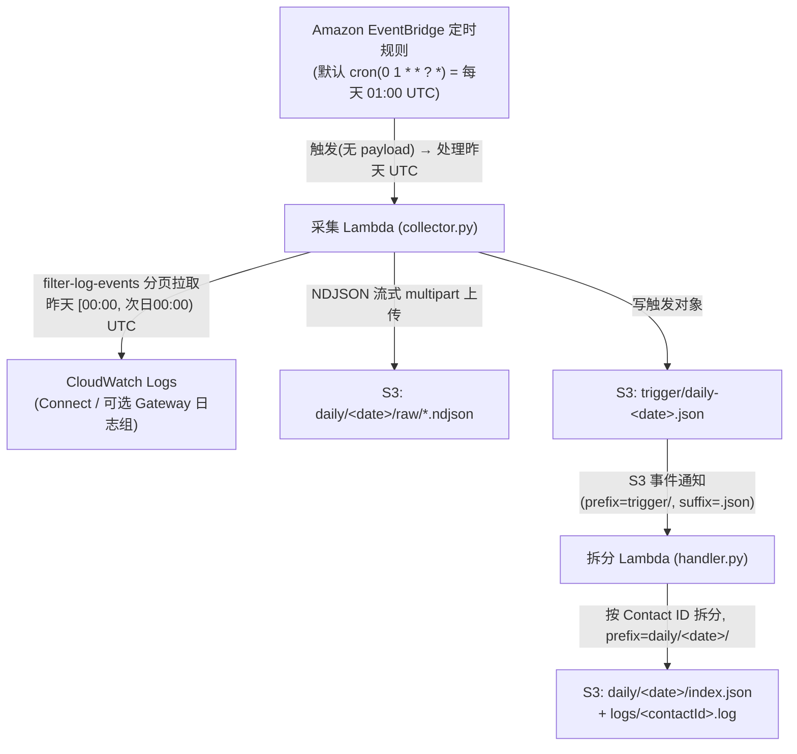
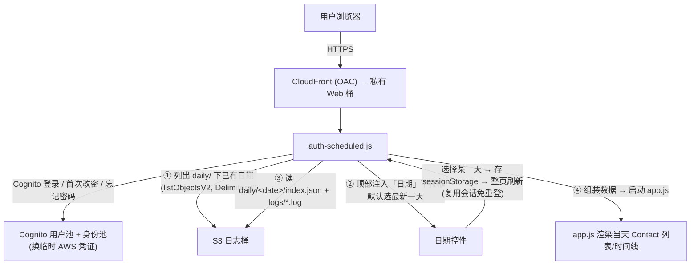

# Amazon Connect AI Agent CloudWatch 日志自动配置

本仓库提供一个脚本，**只需传入 Amazon Connect 实例 ARN**，即可自动为该实例下的 Connect AI Agent（底层为 Amazon Q in Connect / Wisdom assistant）配置 CloudWatch Logs 日志投递。

| 文件 | 说明 |
|------|------|
| [`setup-connect-ai-agent-logs.sh`](./setup-connect-ai-agent-logs.sh) | 一键配置脚本，幂等可重复执行 |
| [`setup-connect-ai-agent-logs-check.sh`](./setup-connect-ai-agent-logs-check.sh) | 只读体检脚本，排查"日志组建好了却没有日志"的问题（见下方章节）|
| [`setup-connect-ai-agent-logs-analysis.sh`](./setup-connect-ai-agent-logs-analysis.sh) | 拉取两路日志、按 Contact ID 关联并本地可视化排查（见文末章节）|
| [`setup-connect-ai-agent-logs-analysis-in-cloudfront.sh`](./setup-connect-ai-agent-logs-analysis-in-cloudfront.sh) | 同上，但把排查页面部署到 CloudFront，并用 Cognito 登录鉴权（见文末章节）|
| [`setup-connect-ai-agent-logs-analysis-in-cloudfront-scheduled.sh`](./setup-connect-ai-agent-logs-analysis-in-cloudfront-scheduled.sh) | 在 CloudFront 版之上增加**定时按天采集**（每天定时处理昨天 UTC 整天日志），页面顶部新增**日期控件**按天查看 Contact 列表（见文末章节）|
| [`load-cloudwatch-logs.sh`](./load-cloudwatch-logs.sh) | 按日志组 ARN 下载全部日志并打包 zip（见文末章节）|
| [`agentcore-evaluation/`](./agentcore-evaluation) | 日志投递配好之后的**自动评估流水线**：定时拉取日志 → 转成 OTEL 格式写入 AgentCore Observability → 自动调用 AgentCore Evaluation / Insights / Recommendation → 结果与图表落到 S3（见该目录 README）|

> 配置原理参考官方文档：[Monitor Connect AI agents by using CloudWatch Logs](https://docs.aws.amazon.com/connect/latest/adminguide/monitor-ai-agents.html)

---

## 前置条件

1. **AWS CLI v2** 已安装，并配置了具备目标账号/区域权限的凭证。
2. 执行身份具备以下权限：
   - Connect：`connect:ListIntegrationAssociations`
   - CloudWatch Logs：`logs:DescribeDeliverySources`、`logs:PutDeliverySource`、`logs:CreateLogGroup`、`logs:PutDeliveryDestination`、`logs:DescribeDeliveries`、`logs:CreateDelivery`
   - 供应日志投递：`wisdom:AllowVendedLogDeliveryForResource`
3. 目标 Connect 实例**已启用 AI agent / Q in Connect**（即存在 `WISDOM_ASSISTANT` 集成关联），否则脚本会在第 2 步报错退出。

---

## 用法

```bash
# 赋予执行权限（首次）
chmod +x setup-connect-ai-agent-logs.sh

# 执行：唯一参数是 Connect 实例 ARN
./setup-connect-ai-agent-logs.sh <amazon-connect-instance-arn>
```

示例：

```bash
./setup-connect-ai-agent-logs.sh \
  arn:aws:connect:us-west-2:991727053196:instance/abcd1234-5678-90ab-cdef-1234567890ab
```

脚本**无需手动指定 region**——region、account-id、instance-id 都从实例 ARN 中解析得到。

### 命名约定

脚本使用以下固定名称：

| 资源 | 名称 |
|------|------|
| 投递源 Delivery Source | `connect-ai-agent-delivery-source` |
| 投递目标 Delivery Destination | `connect-ai-agent-delivery-destination` |
| 日志组 Log Group | `/aws/connect/ai-agent-logs` |

> 如果脚本检测到该 assistant 已存在投递源，会自动复用其原有名称，而非强制使用上表中的名字。

---

## 执行逻辑

脚本按以下顺序执行，每一步都做了**幂等处理**（已存在则复用/跳过），因此可以安全地重复运行。

```
输入: Connect 实例 ARN
  │
  ├─ ① 校验并解析 ARN  →  region / account-id / instance-id
  │
  ├─ ② 查询 WISDOM_ASSISTANT 集成关联  →  得到 assistant ARN
  │      (connect list-integration-associations)
  │
  ├─ ③ 投递源 Delivery Source
  │      已存在指向该 assistant 的源? → 复用
  │      否则创建 (logs put-delivery-source, logType=EVENT_LOGS)
  │
  ├─ ④ 日志组 Log Group  (/aws/connect/ai-agent-logs)
  │      创建; 已存在则跳过 (logs create-log-group)
  │
  ├─ ⑤ 投递目标 Delivery Destination
  │      创建/更新, 输出 json 到 CloudWatch Logs
  │      (logs put-delivery-destination)
  │
  └─ ⑥ 投递关系 Delivery
         已存在(同源+同目标)? → 跳过
         否则创建 (logs create-delivery)
  │
  ▼
完成: 打印资源汇总与查看日志的命令
```

### 各步骤详解

1. **解析与校验实例 ARN**
   用正则校验 ARN 形态 `arn:aws:connect:<region>:<account>:instance/<id>`，并用 `cut` 拆出 region、account-id、instance-id，作为后续所有命令的输入。

2. **定位 Wisdom assistant ARN**
   官方配置实际需要的是 `arn:aws:wisdom:...:assistant/...`，而用户只提供了实例 ARN。脚本通过 Connect 的集成关联接口把二者打通，取第一条 `WISDOM_ASSISTANT` 关联的 `IntegrationArn`。若查不到则说明实例未启用 AI agent，直接报错退出。

3. **创建/复用投递源**
   先查询是否已有指向该 assistant 的投递源（控制台启用功能时常会自动创建）。有则复用其名称，无则以 `EVENT_LOGS` 类型新建。

4. **确保日志组存在**
   投递目标指向 CloudWatch Logs 时，目标日志组必须先存在。`create-log-group` 若返回"已存在"错误则视为正常并跳过。

5. **创建/更新投递目标**
   指定 `outputFormat=json`，`destinationResourceArn` 指向日志组（ARN 结尾带 `:*`）。返回的投递目标 ARN 供下一步使用。

6. **创建投递关系**
   将"投递源"与"投递目标"关联，正式开始投递。先检查是否已存在相同源+目标的投递关系，避免重复创建。

---

## 涉及的 API 用途说明

### Amazon Connect

| API / CLI | 用途 |
|-----------|------|
| `connect list-integration-associations` | 列出 Connect 实例的集成关联。脚本用 `--integration-type WISDOM_ASSISTANT` 过滤，拿到底层 Q in Connect (Wisdom) assistant 的 ARN |

### CloudWatch Logs（供应日志投递三件套 + 日志组）

CloudWatch 的"供应日志（vended logs）"由三个对象串联组成：**投递源**指明"监控谁"，**投递目标**指明"存到哪"，**投递关系**把两者连起来开始投递。

| API / CLI | 用途 |
|-----------|------|
| `logs describe-delivery-sources` | 查询现有投递源，判断目标 assistant 是否已有投递源以便复用 |
| `logs put-delivery-source` | 创建投递源，指向 assistant 资源，`logType=EVENT_LOGS`（Connect AI agent 当前支持的日志类型）|
| `logs create-log-group` | 创建用于存储日志的 CloudWatch 日志组 `/aws/connect/ai-agent-logs` |
| `logs put-delivery-destination` | 创建/更新投递目标，指定存储位置（CloudWatch Logs）与输出格式（`json`）|
| `logs describe-deliveries` | 查询现有投递关系，避免重复创建 |
| `logs create-delivery` | 创建投递关系，把投递源与投递目标关联，正式开始投递 |

> `outputFormat` 还支持 `plain`、`w3c`、`raw`、`parquet`；投递目标除 CloudWatch Logs 外也可改为 Amazon S3 或 Amazon Data Firehose（需调整 `destinationResourceArn` 及相应资源权限）。

---

## 验证与查看日志

脚本执行成功后，会打印资源汇总和查看命令。产生真实会话事件后，可这样实时查看：

```bash
aws logs tail "/aws/connect/ai-agent-logs" --region <your-region> --follow
```

也可在 CloudWatch Logs Insights 中按会话过滤：

```
filter session_id   = "<SessionId>"
filter session_name = "<SessionName>"
```

> 短时间内看不到日志属正常现象——只有在有真实通话/聊天/任务/邮件会话事件时才会投递。

---

## 常见问题

- **报错"未找到 WISDOM_ASSISTANT 集成关联"**
  说明该 Connect 实例尚未启用 AI agent / Q in Connect，请先在 Connect 控制台启用。也可手动运行 `aws connect list-integration-associations --instance-id <id> --region <region>` 确认实际的 `IntegrationType` 取值。

- **`ServiceQuotaExceededException`**
  CloudWatch Logs 投递相关 API 存在配额限制，参见 [CloudWatch Logs endpoints and quotas](https://docs.aws.amazon.com/general/latest/gr/cwl_region.html)。

- **重复执行会不会建出重复资源？**
  不会。投递源、日志组、投递关系均做了存在性检查，幂等执行。

- **能否投递到 S3 / Firehose？**
  可以。修改脚本第 5 步的 `destinationResourceArn` 为对应的 S3 桶或 Firehose 流 ARN，并配置相应的资源策略。

---

# 投递链体检（setup-connect-ai-agent-logs-check.sh）

配好之后最常见的困惑是：**日志组 `/aws/connect/ai-agent-logs` 建出来了，但拨打电话 / test chat 跟 AI agent 交互后，里面一直没有任何日志。** 这个脚本对整条投递链做一次**只读**体检，把问题定位到具体环节。

整条链路是 **投递源(assistant) → 投递目标(日志组) → 投递关系**，只要其中任意一环和你实际触发的 AI agent 对不上，日志组就会一直为空。脚本只读，不创建/修改任何资源，可安全反复运行。

## 用法

```bash
chmod +x setup-connect-ai-agent-logs-check.sh

# 唯一参数与 setup 脚本一致：Connect 实例 ARN(不传则交互式提示输入)
./setup-connect-ai-agent-logs-check.sh <amazon-connect-instance-arn>
```

示例：

```bash
./setup-connect-ai-agent-logs-check.sh \
  arn:aws:connect:us-west-2:991727053196:instance/abcd1234-5678-90ab-cdef-1234567890ab
```

## 检查项

脚本按 7 步逐项检查，每项给出 `[OK] / [WARN] / [FAIL]`：

| 步骤 | 检查内容 | 目的 |
|------|----------|------|
| 1 | 解析实例 ARN | 得到 region / account-id / instance-id |
| 2 | `WISDOM_ASSISTANT` 集成关联 | 确认 AI agent 已启用；统计 assistant 数量（多个会告警，因为 setup 只用第一个）|
| 3 | 投递源 Delivery Source | 是否指向该 assistant、`logType` 是否为 `EVENT_LOGS`；找不到时列出该 region 现有投递源，便于看是否指向了别的 ARN |
| 4 | 日志组 Log Group | `/aws/connect/ai-agent-logs` 是否存在 |
| 5 | 投递目标 Delivery Destination | 是否指向该日志组 |
| 6 | 投递关系 Delivery | 投递源与投递目标是否已 `CreateDelivery` 关联 |
| 7 | 日志组是否已产生日志 | 有无日志流 / 最近 24 小时是否有新事件 |

最后打印"通过 / 警告 / 失败"汇总、按情况给出**后续建议**，并附上实时观察命令：

```bash
aws logs tail "/aws/connect/ai-agent-logs" --region <your-region> --follow
```

> 退出码：全部通过或仅有警告返回 `0`；存在 `[FAIL]` 环节时返回 `2`，方便在 CI / 脚本里判断。

## 如何看结论

- **有 `[FAIL]`**：投递链本身没搭好（缺投递源/目标/关系，或指向了错误资源），日志不可能进来 —— 通常重跑 `setup-connect-ai-agent-logs.sh` 即可。
- **2–6 全 `[OK]`，但第 7 步为空**：投递链没问题，日志为空多半是**使用姿势**问题：
  - 交互没有真正进入**自助式(self-service) AI agent** —— 只有它直接与客户对话时才产生 EVENT_LOGS；agent-assist（给人工坐席推荐）、普通播放提示 / Lex 机器人都不会产生这套日志；
  - 会话发生在**建链之前** —— 历史交互不会补投，需在建链后发起**全新**会话；
  - **首条投递有几分钟延迟** —— 发起新会话后稍等 3~5 分钟再看。
- **第 2 步告警（多个 assistant）**：确认 setup 脚本用的第一个 assistant，就是你 AI agent 实际绑定的那个，否则日志会投到别的源。

---

# 日志解析与可视化排查（setup-connect-ai-agent-logs-analysis.sh）

本脚本从配置文件 `config.env` 指定的**两个 CloudWatch 日志组**实时拉取日志，按 **Contact ID 关联**成可视化时间线，生成静态 HTML 页面并**在本地预览**：

1. **Amazon Connect AI Agent 日志**（会话编排 / LLM 调用 / trace / 转人工）
2. **Bedrock AgentCore Gateway 应用日志**（MCP server / 工具调用 / 网关错误）

把两路日志放在同一条时间线上，排查「AI 说要调用某工具 → 网关实际执行情况」这类跨系统问题时一眼可见。排查能力参考官方 Workshop：[Logging & Observability · CloudWatch](https://catalog.workshops.aws/amazon-connect-ai-agents/en-US/01-foundation/09-logging-observability/05-cloudwatch)。

| 文件 | 说明 |
|------|------|
| [`setup-connect-ai-agent-logs-analysis.sh`](./setup-connect-ai-agent-logs-analysis.sh) | 读配置 → 拉两路 CloudWatch 日志 → 关联构建 → 本地预览 |
| [`config.env.example`](./config.env.example) | 配置模板（占位符）；复制为 `config.env` 后填入真实 ARN |
| `config.env` | 你的实际配置（含账号/ARN，已在 `.gitignore` 中，不提交）|
| `lib/parse-connect-ai-logs.py` | 归一化两路日志并按 Contact ID 关联成 `data.js` |
| `lib/web/index.html`、`lib/web/app.js` | 排查页面（前端按 Contact ID 分组、解析事件、还原对话）|

## 配置文件（config.env）

仓库只提供模板 `config.env.example`，首次使用时复制一份并填入自己的日志组 ARN：

```bash
cp config.env.example config.env
# 然后编辑 config.env，填入两个日志组 ARN(可带结尾的 :*)
```

`config.env` 内容形如：

```bash
# Amazon Connect AI Agent 的 CloudWatch 日志组 ARN
CONNECT_AI_AGENT_LOG_ARN="arn:aws:logs:us-west-2:991727053196:log-group:/aws/connect/ai-agent-logs:*"

# Bedrock AgentCore Gateway 的 CloudWatch 日志组 ARN
BEDROCK_AGENTCORE_GATEWAY_LOG_ARN="arn:aws:logs:us-west-2:991727053196:log-group:/aws/vendedlogs/bedrock-agentcore/gateway/APPLICATION_LOGS/connect-repair-mcp-server-gw-4aosemuo03:*"

# (可选) CSAT 满意度评分对应的 Amazon Connect 联系人属性键名
# 不配置时默认取 botevaluation
CSAT_ATTRIBUTE_KEY="botevaluation"
```

脚本会从 ARN 自动解析出 region 与日志组名，无需另填区域。

> `config.env` 含 AWS 账号 ID 与日志组 ARN，已加入 `.gitignore` 不会被提交；请勿把它推送到代码仓库。

## 可选：Amazon Connect 补充数据与 CSAT 满意度评分

页面部分列（通话智能摘要、挂断方、CSAT 满意度评分、接电话的 DID 等）无法从 CloudWatch AI Agent 日志里获取，需要额外调用 Amazon Connect API 补充：

- **本地预览版**：由 [`lib/fetch-connect-contact-details.py`](./lib/fetch-connect-contact-details.py) 调 `describe-contact` / `get-contact-attributes`，为每个 Contact 生成 `connect-enrich.js` 供前端消费；缺失字段显示 N/A。
- **CloudFront 版**：登录后由浏览器用临时凭证实时调 `DescribeContact` 补齐。

> **关于「通话摘要」（生成式自动交互摘要）**：该摘要**不在** `DescribeContact` 返回体里，而在与通话录音**同一个 S3 桶**的分析结果 JSON 中，路径把 `.../CallRecordings/<sub>/<date>/` 映射为 `Analysis/Voice`（聊天为 `Analysis/Chat`）`/<sub>/<date>/`，文件名形如 `<contactId>_analysis_*.json`，取其 `ConversationCharacteristics.ContactSummary.AutomatedInteractionSummary.Content`。
> - 本地预览版：`fetch-connect-contact-details.py` 会先从 `DescribeContact` 拿到录音位置，再读取该分析结果 JSON 补全摘要（需要对录音桶的 `s3:ListBucket` / `s3:GetObject` 权限）。
> - CloudFront 版：部署脚本会自动用 `list-instance-storage-configs` 解析出录音桶名，注入前端并给登录角色授予该桶 `Analysis/*` 的只读权限；浏览器登录后即可读取并显示摘要。若解析不到录音桶，摘要列回退显示 N/A。

其中 **CSAT 满意度评分** 取自 Amazon Connect 联系人属性（Contact Attributes）里的某个自定义键。不同账号 / Contact Flow 写入的键名可能不同，因此**键名不写死，可通过配置指定**：

- 配置项为 `config.env` 里的 `CSAT_ATTRIBUTE_KEY`；**不配置时默认取 `botevaluation`**。
- 键名解析优先级（后端脚本）：`--csat-attr` 参数 > 环境变量 `CSAT_ATTRIBUTE_KEY` > `config.env` 里的 `CSAT_ATTRIBUTE_KEY` > 默认值 `botevaluation`。
- 要让该列真正有值，需在 Contact Flow 里把满意度调查结果写入该联系人属性。

生成本地补充数据示例：

```bash
python3 lib/fetch-connect-contact-details.py \
  --instance-id <connect-instance-id> --region us-east-1 \
  --data-js dist/data.js --out dist/connect-enrich.js
# 用非默认属性键名(例如 surveyResult)时:
python3 lib/fetch-connect-contact-details.py \
  --instance-id <connect-instance-id> --region us-east-1 \
  --data-js dist/data.js --out dist/connect-enrich.js \
  --csat-attr surveyResult
```

## 用法

```bash
chmod +x setup-connect-ai-agent-logs-analysis.sh

# 首次使用先准备配置文件
cp config.env.example config.env   # 然后编辑 config.env 填入两个日志组 ARN

# 读取 config.env，拉取最近 24 小时两路日志并启动本地预览(默认行为)
./setup-connect-ai-agent-logs-analysis.sh
# 浏览器打开 http://localhost:8080

# 自定义时间范围 / 端口 / 配置文件
./setup-connect-ai-agent-logs-analysis.sh --hours 6 --port 9000
./setup-connect-ai-agent-logs-analysis.sh --config ./my.env

# 只构建不预览
./setup-connect-ai-agent-logs-analysis.sh --no-serve
```

### 参数

| 参数 | 说明 | 默认 |
|------|------|------|
| `--config <file>` | 配置文件路径 | `./config.env` |
| `--hours <n>` | 拉取最近 n 小时日志 | `24` |
| `--out-dir <dir>` | 站点构建输出目录 | `./dist` |
| `--no-serve` | 只构建，不启动本地预览 | 默认会启动 |
| `--port <n>` | 本地预览端口 | `8080` |

> 若指定端口被占用，脚本会自动向后顺延探测一个空闲端口（最多 +20）并在该端口启动预览。

> 需要 aws cli v2 且已配置凭证，执行身份需具备目标两个日志组的 `logs:FilterLogEvents` 权限。

## 核心概念：Contact ID 与跨源关联

- Connect 日志里的 **`session_name`**（也出现在 span 的 `session_name=...`）就是 Amazon Connect 的 **Contact ID**；**`session_id`** 是底层 Q in Connect 的内部会话 ID。
- 页面以 **Contact ID 为主键**分组，并通过 `session_id → session_name` 映射，把只带 `session_id` 的事件（如 `TRANSCRIPT_UTTERANCE`）归并到正确的 Contact 下。
- **Gateway 日志**按以下顺序关联到 Contact：
  1. 消息文本里直接出现某个已知 `contactId` / `sessionId` → 关联到该会话；
  2. 否则按时间落入某个 Contact 的活动时间窗（左右各放宽 5 秒）→ 关联到最接近的会话；
  3. 都不满足 → 归入「未关联的 Gateway 日志」分组。

## 页面能做什么

- **左侧** 按 Contact ID 列表，支持搜索；徽标直观显示「工具调用 / 网关日志 / 转人工 / 错误 / 护栏拦截」，便于一眼定位异常会话。每个 Contact 右侧提供两个快捷操作：
  - **⧉ 拷贝**：一键把该 Contact ID 复制到剪贴板（复制成功后图标短暂变为 ✓）。
  - **⬇ 下载**：把该 Contact 对应的日志导出为 CSV 文件 `contact-<id>-logs.csv`，**同时包含 Amazon Connect AI Agent 与 Bedrock Gateway 两路日志**，按时间排序。列为 `timestamp_ms, datetime, source, event_type, message`（带 UTF-8 BOM，Excel 可直接打开）。
- **右侧** 是该 Contact 的事件时间线，按时间排序，每个事件带 **Connect / Gateway 来源标签**，可按事件类型过滤：
  - `UTTERANCE`：客户/机器人逐句话术
  - `ORCHESTRATION_MESSAGE`：编排层对外消息（自动拆出 `<message>` 与 `<thinking>`）
  - `AGENTIC_MESSAGE` / `LARGE_LANGUAGE_MODEL_INVOCATION`：还原送给模型的多轮对话、工具调用与工具返回
  - `AI_AGENT_TRACE`：span 调用链（`invoke_agent` / `inference` / `execute_tool` / `escalate_agent`），含状态、耗时、Token 用量
  - `CREATE_SESSION` / `SESSION_POLLED`：会话生命周期与坐席分配
  - `GATEWAY`：Bedrock AgentCore Gateway 应用日志（JSON 或纯文本均兼容，自动标记 ERROR）
- 每个事件都可展开查看**原始 JSON**，排查时既能看结构化视图也能看原文。

## 构建流程

```
CONNECT_AI_AGENT_LOG_ARN ─┐
                          ├─ aws logs filter-log-events(自动翻页)
BEDROCK_..._GATEWAY_LOG_ARN ┘            │
                                         ▼
              parse-connect-ai-logs.py  → dist/data.js
              (归一化 + 修复非法 JSON 转义 + 按 Contact ID 关联两路日志)
                          │  + index.html + app.js
                          ▼
              本地静态站点 → python3 -m http.server → 浏览器排查页面
```

- 站点是**纯静态**，`data.js` 在构建时生成；日志更新后重新执行脚本即可刷新数据。
- 拉取与构建在本地完成，不会把会话内容上传到任何外部服务。

> 注意：`data.js` 中包含完整会话内容（可能含 PII）。请仅在受信任的本机环境查看，不要把 `dist/` 目录直接对外公开。

## 常见问题

- **页面空白 / 没有 Contact**：确认两个日志组在所选时间范围内确有日志；可加大 `--hours`。CloudWatch 只有在产生真实会话时才会投递。
- **Gateway 日志都进了「未关联」分组**：说明网关日志里既没有出现 contactId/sessionId，时间上也没落入任一会话窗口。可确认两个日志组属于同一套环境、时钟一致，或加大时间范围。
- **拉不到日志**：检查 `config.env` 里的 ARN、region 是否正确，以及当前身份是否有对应日志组的 `logs:FilterLogEvents` 权限。
- **日志里有非法 JSON 导致解析失败？** 解析脚本会把模型多行输出产生的「反斜杠+换行」等非法转义自动修复，并重新序列化成合法 JSON 写入 `data.js`；Gateway 的纯文本日志则原样保留。
- **拷贝按钮不生效？** 浏览器的剪贴板 API 仅在安全上下文（`localhost` 或 HTTPS）可用；本地预览用 `localhost` 即可。若仍不可用，脚本前端会自动回退到兼容方式，必要时弹出文本框供手动复制。
- **下载的 CSV 里都有什么？** 该 Contact 名下的全部事件（Connect + Gateway），按时间排序，列为 `timestamp_ms, datetime, source, event_type, message`，`message` 为原始日志内容。文件带 UTF-8 BOM，Excel 可直接正确识别中文。

---

# 下载并打包 CloudWatch 日志（load-cloudwatch-logs.sh）

当你只想把**某一个** CloudWatch 日志组的日志整体导出、离线归档或发给他人排查时，用这个脚本最省事：交互式（或用参数）传入一个日志组 ARN，脚本会自动翻页拉取该日志组下**所有日志流**的全部事件，并打包成一个 zip 文件。

| 文件 | 说明 |
|------|------|
| [`load-cloudwatch-logs.sh`](./load-cloudwatch-logs.sh) | 按日志组 ARN 拉取全部日志 → 生成 JSON/文本 → 打包 zip |

## 前置条件

- **AWS CLI v2** 已安装并配置凭证，执行身份具备目标日志组的 `logs:FilterLogEvents` 权限。
- 本机具备 `python3` 与 `zip` 命令。

## 用法

```bash
chmod +x load-cloudwatch-logs.sh

# 方式一：直接运行，按提示交互式粘贴日志组 ARN(拉取全部历史日志)
./load-cloudwatch-logs.sh

# 方式二：用参数直接指定 ARN
./load-cloudwatch-logs.sh --arn "arn:aws:logs:us-west-2:991727053196:log-group:/aws/connect/ai-agent-logs:*"

# 只拉取最近 24 小时，并指定 zip 输出路径
./load-cloudwatch-logs.sh \
  --arn "arn:aws:logs:us-west-2:991727053196:log-group:/aws/connect/ai-agent-logs:*" \
  --hours 24 \
  --zip ./my-logs.zip
```

ARN 可带结尾的 `:*`，脚本会自动从 ARN 解析出 region 与日志组名，无需另填区域。

### 参数

| 参数 | 说明 | 默认 |
|------|------|------|
| `--arn <arn>` | CloudWatch 日志组 ARN；不提供时交互式提示输入 | 交互式输入 |
| `--hours <n>` | 只拉取最近 n 小时日志；为 0 或不填则拉取全部历史 | `0`（全部历史）|
| `--out-dir <dir>` | 日志文件输出目录 | 脚本所在目录 |
| `--zip <file>` | 打包生成的 zip 路径 | `./cloudwatch-logs-<时间戳>.zip` |

## 执行流程

```
输入: CloudWatch 日志组 ARN(参数或交互式)
  │
  ├─ 从 ARN 解析 region 与日志组名
  │
  ├─ 阶段一 预扫描: 先翻页数一遍, 得到总页数与总事件数
  │
  ├─ 阶段二 拉取: aws logs filter-log-events 自动翻页, 实时显示进度
  │              (进度: 已完成页/总页, 已拉取条数/总条数, 百分比)
  │
  ├─ 写出两个文件:
  │     events.json  完整结构化数据(logGroup/region/events)
  │     events.log   按时间排序的可读文本(时间 \t 日志流名 \t 消息)
  │
  └─ 打包: 把上述两个文件压缩进 zip
  │
  ▼
完成: 打印事件数量、日志文件路径与 zip 路径
```

- 默认日志文件直接生成在**脚本所在目录**（`events.json`、`events.log`），zip 里也只包含这两个文件。
- 拉取分两个阶段：先预扫描算出总量，再带**实时进度**下载，方便判断大日志组的进度。

## 常见问题

- **未拉取到任何日志事件**：确认所选时间范围内确有日志（可去掉 `--hours` 拉取全部历史，或加大范围如 `--hours 720`）；核对 ARN 的日志组名与 region；确认当前身份具备 `logs:FilterLogEvents` 权限。
- **预扫描为何要多请求一遍？** `filter-log-events` 无法直接返回总数，为了在下载前给出准确的总页数/总条数用于进度显示，脚本会先翻页统计一次，再正式拉取。日志量很大时这会使 API 调用翻倍。
- **zip 里包含哪些内容？** 仅本次生成的 `events.json` 与 `events.log`，不会把目录里的其它文件一起打包。

---

# 部署到 CloudFront + Cognito 登录鉴权（setup-connect-ai-agent-logs-analysis-in-cloudfront.sh）

`setup-connect-ai-agent-logs-analysis.sh` 只在本机预览；如果想把排查页面**部署到互联网**、并且**只允许指定邮箱的用户登录后查看**，用这个脚本。它拉取日志后按 Contact ID 拆分上传到 S3，把 Web 应用发布到 CloudFront，并用 Amazon Cognito 完成登录、首次改密与忘记密码。

| 文件 | 说明 |
|------|------|
| [`setup-connect-ai-agent-logs-analysis-in-cloudfront.sh`](./setup-connect-ai-agent-logs-analysis-in-cloudfront.sh) | 建桶+事件通知+Lambda → 拉取原始日志直传 S3 → 触发云端拆分 → 部署 CloudFront → 配置 Cognito 登录 |
| `lib/fetch-to-s3.py` | 把一个日志组的全部事件以 NDJSON **流式直传**到 S3 的 `raw/` 前缀（本地不落文件、极小内存）|
| `lib/lambda/handler.py` | S3 事件触发的 **Lambda**：读取 `raw/` 原始日志，按 Contact ID 拆分生成 `<contactId>.log` 与 `index.json` 写回桶（云端处理）|
| `lib/parse-connect-ai-logs.py` | 归一化与关联逻辑；随 Lambda 部署包一起打包为 `connect_parser.py` 复用 |
| `lib/web-cloudfront/auth.js` | 登录门禁：Cognito 登录/改密/忘记密码 + 登录后从 S3 加载日志再启动排查页面 |

## 架构（全程不在本地处理日志文件）

```
CloudWatch 两路日志
    │  fetch-to-s3.py: filter-log-events(翻页) 直接流式上传(不落本地)
    ▼
S3: ai-agent-logs<suffix>/raw/{connect,gateway}.ndjson   ← 原始数据长期保存
    │  上传 trigger/process.json  →  S3 事件通知
    ▼
Lambda (handler.py): 读 raw/ → 按 Contact ID 拆分 → 写回
    ▼
S3: ai-agent-logs<suffix>/logs/<contactId>.log + index.json   (私有; CORS 允许浏览器读)
    ▲  登录用户经 Cognito 身份池换取的临时凭证直接读取
    │
浏览器 ── CloudFront(OAC) ── S3: ai-agent-logs<suffix>-web (私有站点)
    │
    └── Cognito 用户池: 登录 / 首次一次性密码改密 / 忘记密码(邮箱验证码)
```

- **日志桶** `ai-agent-logs<suffix>`：存放 `raw/`（原始数据）、`logs/<contactId>.log`、`index.json`；不存在时自动创建，并配置 S3 事件通知关联解析 Lambda。页面加载时由登录用户凭证直接从此桶读取。
- **云端解析（Lambda）**：原始日志与按 Contact 拆分**全部在云端完成**，本地机器只负责把 CloudWatch 数据流式直传到 S3，**不在本地处理任何文件**。因此即便 `CONNECT_AI_AGENT_LOG_ARN` 的日志很大，也不会占用本地磁盘（适合 CloudShell 等磁盘受限环境）。
- **原始数据保存**：`raw/connect.ndjson`、`raw/gateway.ndjson` 保留未改写的原始日志；Lambda 在读取时才做清洗/关联。
- **幂等**：Lambda 写每个 Contact 的 `.log` 前会先检查是否已存在，已存在则跳过，重跑不会重复写。
- **站点桶** `ai-agent-logs<suffix>-web`：私有，仅经 CloudFront 源访问控制（OAC）读取；站点文件由脚本**直传**上传，本地不落文件。
- **Cognito 用户池**：用邮箱登录。`admin-create-user` 会把**一次性密码**发到该邮箱，首次登录后强制设置新密码。
- **Cognito 身份池**：登录成功后换取只读访问日志桶的临时 AWS 凭证。

## 前置条件

- **AWS CLI v2**（已配置凭证），执行身份需具备：CloudWatch Logs 读取、S3、CloudFront、Cognito（idp/identity）、Lambda（建/更函数、加权限）、IAM（建角色与内联策略）的权限。
- 本机具备 **python3**。
- 处理规模较大时，云端 Lambda 受其内存/超时限制（脚本默认 2048MB / 900s）；如需处理超大日志可调大这两个值。

## 用法

```bash
chmod +x setup-connect-ai-agent-logs-analysis-in-cloudfront.sh

# 交互式(未提供的必选项会逐个询问)
./setup-connect-ai-agent-logs-analysis-in-cloudfront.sh

# 或直接用参数
./setup-connect-ai-agent-logs-analysis-in-cloudfront.sh \
  --connect-arn "arn:aws:logs:us-west-2:111122223333:log-group:/aws/connect/ai-agent-logs:*" \
  --gateway-arn "arn:aws:logs:us-west-2:111122223333:log-group:/aws/vendedlogs/bedrock-agentcore/gateway/APPLICATION_LOGS/<gw>:*" \
  --email you@example.com \
  --suffix -demo
```

### 参数

| 参数 | 说明 | 默认 |
|------|------|------|
| `--connect-arn <arn>` | Connect AI Agent 日志组 ARN | 必选（未提供则交互式询问）|
| `--gateway-arn <arn>` | Bedrock AgentCore Gateway 日志组 ARN | 可选 |
| `--email <addr>` | 登录用户邮箱（接收一次性密码）| 必选 |
| `--suffix <s>` | 桶名后缀，日志桶为 `ai-agent-logs<suffix>` | 必选（仅小写字母/数字/连字符）|
| `--region <r>` | 部署区域 | 取自 `--connect-arn` |
| `--hours <n>` | 仅拉取最近 n 小时；0 = 全部历史 | `0` |
| `--profile <p>` | AWS CLI profile | 默认凭证 |
| `--out-dir <dir>` | 本地构建目录 | `./dist-cloudfront` |
| `--csat-attr <key>` | CSAT 满意度评分对应的联系人属性键名（注入前端供浏览器实时读取）| `botevaluation` |

## 登录流程

1. 脚本部署完成后打印 **CloudFront 访问地址**。
2. 打开该地址，用 `--email` 邮箱和邮件里收到的**一次性密码**登录；系统会要求**设置新密码**，之后用新密码登录。
3. 登录页提供**「忘记密码」**：点击并填入邮箱，Cognito 会向该邮箱发送**新的验证码**，输入验证码与新密码即可重置。

> CloudFront 首次部署通常需数分钟才全球生效。更新日志后重跑脚本会重新拆分上传，并对 CloudFront 缓存发起一次失效。

## 常见问题

- **收不到一次性密码邮件？** 默认使用 Cognito 内置邮件发送（有每日额度）。检查垃圾箱；生产环境建议在用户池里改用 Amazon SES。
- **页面空白 / 没有 Contact？** 说明所选时间范围内日志为空，去掉 `--hours` 拉取全部历史，或核对日志组 ARN 与权限。
- **页面提示加载日志失败？** 多为身份池角色权限或桶 CORS 问题；脚本已自动为鉴权角色授予该桶只读权限并配置 CORS，重跑脚本即可修复。
- **翻译按钮为何不见了？** CloudFront 是纯静态托管，没有本地 `serve.py` 的按需翻译接口，因此翻译功能自动隐藏（本地预览版仍可用）。

---

# 定时按天采集 + 日期控件（setup-connect-ai-agent-logs-analysis-in-cloudfront-scheduled.sh）

CloudFront 版（`setup-connect-ai-agent-logs-analysis-in-cloudfront.sh`）是**一次性**部署：本地把日志拉一遍、拆分上传、发布页面。数据不会自动更新，页面也只展示"这一次拉到的全部数据"。

本脚本在其**全部能力之上**（S3 日志桶 + 云端拆分 Lambda + Cognito 登录 + CloudFront 站点），新增两件事：

1. **定时按天采集**：部署一个由 **Amazon EventBridge** 定时触发（默认每天 **01:00 UTC**）的**采集 Lambda**，每次处理**昨天（UTC）一整天** `[00:00, 次日 00:00)` 的日志，按日期分区归档到 S3 并触发云端拆分。
2. **页面日期控件**：站点顶部新增「日期」下拉框，选择某一天即加载并展示**当天的 Contact 列表**与会话时间线。

全程不在本地处理任何日志文件（采集、拆分均在云端）。

| 文件 | 说明 |
|------|------|
| [`setup-connect-ai-agent-logs-analysis-in-cloudfront-scheduled.sh`](./setup-connect-ai-agent-logs-analysis-in-cloudfront-scheduled.sh) | 部署日志桶+拆分 Lambda+**采集 Lambda**+**EventBridge 定时规则**+Cognito+CloudFront，并可回补最近若干天 |
| [`lib/lambda/collector.py`](./lib/lambda/collector.py) | **采集 Lambda**：定时（或手动带 `date`）拉取某个 UTC 日的 CloudWatch 日志，流式（multipart）归档到 `daily/<date>/raw/`，再写触发对象触发拆分 |
| [`lib/lambda/handler.py`](./lib/lambda/handler.py) | 复用 CloudFront 版的**拆分 Lambda**：按 `trigger/*.json` 里的 `prefix` 把该天日志拆到 `daily/<date>/index.json` + `logs/*.log` |
| [`lib/web-cloudfront/auth-scheduled.js`](./lib/web-cloudfront/auth-scheduled.js) | 在 `auth.js` 基础上新增：登录后列出可选日期、注入「日期」控件、按天加载数据；切换日期时复用会话免重登 |

## 数据按日期分区

所有数据都落在**按 UTC 日期分区**的前缀下，各天互不干扰：

```
s3://ai-agent-logs<suffix>/
├─ daily/
│  ├─ 2026-08-12/
│  │  ├─ raw/connect.ndjson        原始日志(长期保存)
│  │  ├─ raw/gateway.ndjson        (若配置了 Gateway)
│  │  ├─ logs/<contactId>.log      按 Contact 拆分
│  │  └─ index.json                当天清单(供前端加载)
│  └─ 2026-08-13/
│     └─ ...
└─ trigger/
   └─ daily-2026-08-13.json        采集写入 → 触发拆分 Lambda
```

## 整体架构与流程图

### 采集与拆分（云端定时）



纯文本等价流程（无法渲染 Mermaid 时参考）：

```
EventBridge 定时规则(每天 01:00 UTC, 可改)
    │  触发(无 payload) → 采集 Lambda 默认处理"昨天(UTC)"
    ▼
采集 Lambda (collector.py)
    │  ① 计算昨天 UTC 起止毫秒 [00:00, 次日00:00)
    │  ② filter-log-events 分页拉取该窗口全部事件
    │  ③ NDJSON 流式 multipart 上传 → daily/<date>/raw/{connect,gateway}.ndjson
    │  ④ 写 trigger/daily-<date>.json (含 prefix=daily/<date>/)
    ▼
S3 事件通知(trigger/ 前缀 + .json 后缀)
    ▼
拆分 Lambda (handler.py)   ← 与一次性 CloudFront 版完全相同
    │  读 raw/ → 按 Contact ID 拆分(prefix=daily/<date>/)
    ▼
daily/<date>/index.json + logs/<contactId>.log
```

### 页面按天查看（浏览器）



纯文本等价流程：

```
浏览器 ── CloudFront(OAC) ── 私有 Web 桶 ── auth-scheduled.js
    │
    ├─ Cognito 登录 → 身份池换取只读日志桶的临时凭证
    │
    ├─ ① 列出 daily/ 下已有日期(listObjectsV2 + Delimiter="/")
    ├─ ② 顶部注入「日期」下拉框, 默认选最新一天
    │        切换日期 → 存 sessionStorage → 整页刷新(会话保持, 免重登)
    ├─ ③ 读取所选 daily/<date>/index.json 与其 logs/*.log
    └─ ④ 组装 window.__CONNECT_AI_LOG_DATA__ → 动态加载 app.js 渲染当天数据
```

> **会话保持**：切换日期采用"整页刷新"以完整复用现有 `app.js` 的渲染逻辑。为避免每次切换都要重新登录，登录成功后会把 Cognito 的 `idToken`（含过期时间）与所选日期暂存到浏览器 `sessionStorage`；刷新后自动静默复用，`idToken` 过期或关闭标签页后失效，需要重新登录。

## 用法

```bash
chmod +x setup-connect-ai-agent-logs-analysis-in-cloudfront-scheduled.sh

# 交互式(未提供的必选项会逐个询问)
./setup-connect-ai-agent-logs-analysis-in-cloudfront-scheduled.sh

# 或直接用参数
./setup-connect-ai-agent-logs-analysis-in-cloudfront-scheduled.sh \
  --connect-arn "arn:aws:logs:us-west-2:111122223333:log-group:/aws/connect/ai-agent-logs:*" \
  --gateway-arn "arn:aws:logs:us-west-2:111122223333:log-group:/aws/vendedlogs/bedrock-agentcore/gateway/APPLICATION_LOGS/<gw>:*" \
  --connect-instance-arn "arn:aws:connect:us-west-2:111122223333:instance/abcd1234-5678-90ab-cdef-1234567890ab" \
  --email you@example.com \
  --suffix -demo \
  --schedule-cron "cron(0 1 * * ? *)" \
  --backfill-days 1
```

### 参数

| 参数 | 说明 | 默认 |
|------|------|------|
| `--connect-arn <arn>` | Connect AI Agent 日志组 ARN | 必选（未提供则交互式询问）|
| `--gateway-arn <arn>` | Bedrock AgentCore Gateway 日志组 ARN | 可选 |
| `--connect-instance-arn <arn>` | Amazon Connect 实例 ARN（供浏览器调 `DescribeContact` 等）| 必选 |
| `--email <addr>` | 登录用户邮箱（接收一次性密码）| 必选 |
| `--suffix <s>` | 桶名后缀，日志桶为 `ai-agent-logs<suffix>` | 必选（仅小写字母/数字/连字符）|
| `--region <r>` | 部署区域 | 取自 `--connect-arn` |
| `--schedule-cron <expr>` | EventBridge 定时表达式（**UTC**）| `cron(0 1 * * ? *)`（每天 01:00 UTC = 北京 09:00）|
| `--backfill-days <n>` | 部署后立即回补最近 n 天（不含今天）；`0` 表示不回补 | `1`（仅昨天）|
| `--profile <p>` | AWS CLI profile | 默认凭证 |
| `--lambda-memory <MB>` | 拆分/采集 Lambda 内存 | `3008` |
| `--csat-attr <key>` | CSAT 满意度评分对应的联系人属性键名 | `botevaluation` |
| `--out-dir <dir>` / `--keep` | 临时部署产物目录 / 保留该目录 | 系统临时目录 / 结束清理 |

> **关于定时时间（UTC）**：`--schedule-cron` 的 cron 是 **UTC**。默认 `cron(0 1 * * ? *)` 为每天 01:00 UTC（= 北京时间每天 09:00）。若想按 **UTC 每天 9 点**运行，用 `cron(0 9 * * ? *)`。cron 六字段含义为 `分 时 日 月 星期 年`（AWS 要求"日"与"星期"其一为 `?`）。

## 定时的时区与"处理哪一天"

- **调度时间**由 `--schedule-cron`（UTC）决定，只影响"每天几点跑"。
- **处理的数据范围**固定为**触发当天的前一天（UTC）整天** `[00:00, 次日 00:00)`——与调度时间无关。因此把定时设在每天凌晨/早上（默认 01:00 UTC）能确保昨天的数据已经齐全。
- 若某次运行漏跑或想补看历史某天，可**手动补采**（见下）。

## 暂停 / 恢复定时（以及在控制台哪里找这条规则）

定时的本质是一条名为 `connect-ai-logs<suffix>-daily` 的 **EventBridge 规则**（建在 **default 事件总线**上、用 `aws events` API 管理的经典 Rule）。想停掉每天自动采集，禁用这条规则即可，页面/历史数据/Lambda 都保留、随时可恢复：

```bash
# 暂停(禁用)
aws events disable-rule --name connect-ai-logs<suffix>-daily --region <region>

# 恢复(启用)
aws events enable-rule  --name connect-ai-logs<suffix>-daily --region <region>

# 查看当前状态 / 定时表达式
aws events describe-rule --name connect-ai-logs<suffix>-daily --region <region> \
  --query '{Name:Name,State:State,Schedule:ScheduleExpression}' --output table
```

> **⚠️ 控制台里在哪找这条规则（免得再找）**
> - 先把控制台右上角**区域切到部署区域**（`--region`，或取自 `--connect-arn`；资源清单文件里的 `REGION|...` 行也能查到）。
> - 打开 **Amazon EventBridge** 后，这条规则会出现在 **Scheduler → Scheduled rules** 列表里（新版控制台把"带 schedule 的经典规则"归到这里展示）；也可在 **Buses → Rules**（Event bus 选 `default`）下找到——**两处指向同一条规则**。
> - 注意别和左侧单独的 **EventBridge Scheduler（Schedules）** 搞混：那是另一套服务，本部署**没有**用它；本规则始终用 `aws events ...` 命令或上述页面管理。
> - 选中规则后点 **Disable / Enable** 即可暂停 / 恢复。

## 手动补采某一天

采集 Lambda 支持带 `date` 手动触发（不必等定时）：

```bash
aws lambda invoke \
  --function-name connect-ai-logs<suffix>-collector \
  --region <region> \
  --cli-binary-format raw-in-base64-out \
  --payload '{"date":"2026-08-10"}' \
  /tmp/out.json && cat /tmp/out.json
```

采集完成后会自动触发拆分 Lambda 生成 `daily/2026-08-10/index.json`；刷新页面即可在「日期」控件里看到该天。

## 与一次性 CloudFront 版的区别

| 维度 | 一次性版（`...-in-cloudfront.sh`）| 定时按天版（本脚本）|
|------|------|------|
| 数据来源 | 本地 `fetch-to-s3.py` 拉取一次 | 云端**采集 Lambda** 定时拉取 |
| 拉取范围 | `--hours`（0=全部历史）| 每次**昨天 UTC 整天**（可回补/手动补采）|
| S3 布局 | 根前缀 `index.json` + `logs/` | 按天分区 `daily/<date>/index.json` + `logs/` |
| 数据更新 | 需重跑脚本 | **每天自动**更新 |
| 页面 | 展示这一次的全部数据 | 顶部**日期控件**按天切换 |
| 额外资源 | — | **采集 Lambda**、**EventBridge 定时规则**、采集角色 |

## 清理

脚本会生成资源清单 `aws-resources-<suffix>-scheduled-<时间戳>.manifest`，其中**已包含**采集 Lambda、采集角色与 EventBridge 定时规则。用 `clear.sh` 按清单一键删除（`clear.sh` 已支持删除 EventBridge 规则：会先移除其 target 再删规则）：

```bash
./clear.sh "aws-resources-<suffix>-scheduled-<时间戳>.manifest"
# 想保留 S3 里已归档的历史日志:
./clear.sh "aws-resources-<suffix>-scheduled-<时间戳>.manifest" --keep-buckets
```

## 常见问题

- **页面提示"暂无按天归档的数据"？** 说明 `daily/` 下还没有任何日期。要么等定时任务首次运行，要么用 `--backfill-days` 重跑、或手动补采某天（见上）。
- **选了某天但列表为空？** 该 UTC 日可能确实没有会话日志；或拆分 Lambda 仍在后台处理（稍等片刻刷新）。CloudWatch 只有产生真实会话时才有日志。
- **定时几点跑、跑的是哪天？** 定时时间看 `--schedule-cron`（UTC）；每次固定处理**昨天（UTC）整天**，与几点跑无关。
- **切换日期为什么会整页刷新？** 为完整复用现有 `app.js` 渲染逻辑而采用刷新；已用 `sessionStorage` 暂存会话，刷新不需要重新登录（除非 token 过期或关闭标签页）。
- **当天日志很大导致采集超时/内存不足？** 采集 Lambda 默认 900s 超时、`--lambda-memory` 内存；日志量很大时调大 `--lambda-memory`（如 `8192`/`10240`）。上传采用 multipart 流式，内存占用受单个分片大小约束。
